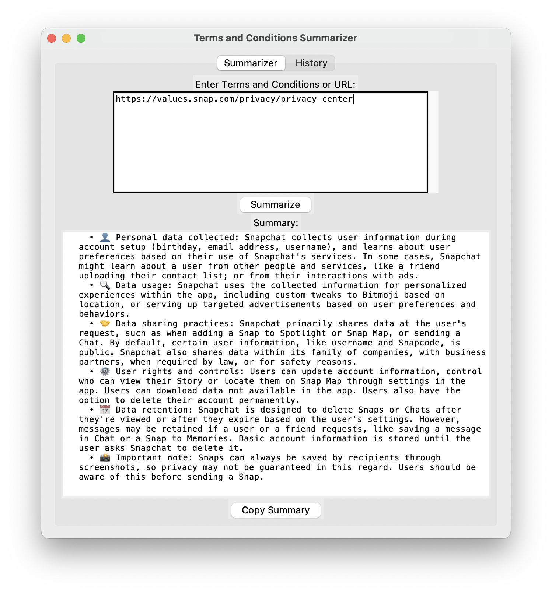
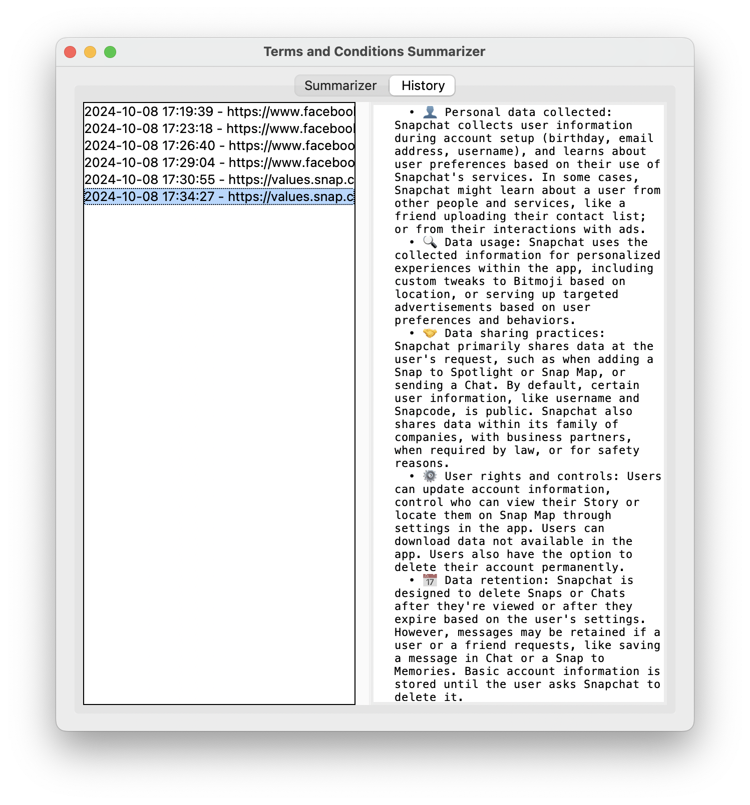

# TnC Summarizer

A Python GUI application that summarizes Terms and Conditions (TnC) and Privacy Policy documents in real-time using AI.

## Features:
- Summarizes TnC from pasted text or URLs
- Built with Cursor IDE
- Utilizes OpenAI's API (ChatGPT) or Anthropic's API (Claude) for summarization
- Provides up-to-date summaries, unlike static TnC summary websites
- Use of relevant emojis for easy visual scanning of key points
- History feature to save and revisit previous summaries
- Copy summary to clipboard functionality
- Selectable text in summary for easy reference

## Prerequisites:
- Python 3.7+
- Running in a virtual environment (venv)
- Install the following packages:
  ```
  pip install openai anthropic requests beautifulsoup4 selenium webdriver_manager tkhtmlview markdown
  ```
  Note: Use `pip install --upgrade openai` if you encounter errors when updating the GPT model.

## Installation:
1. Clone this repository:
   ```
   git clone https://github.com/yourusername/tnc-summarizer.git
   ```
2. Navigate to the project directory:
   ```
   cd tnc-summarizer
   ```
3. Install the required packages as listed in the Prerequisites section.

## Usage:
1. Replace the placeholder with your OpenAI API key or Anthropic API key in the code, depending on which version you're using.
2. Run the application:
   ```
   python TnC.py
   ```
3. Enter the T&C or Privacy Policy text or URL in the input field.
4. Click "Summarize" to generate a summary.
5. View the summary in the output field.
6. Use the "Copy Summary" button to copy the summary to your clipboard.
7. Access previous summaries from the History tab.

## Configuration:
- For ChatGPT version: Replace 'your-openai-api-key-here' in the `get_summary_from_chatgpt` method with your actual OpenAI API key.
- For Claude version: Replace 'your-anthropic-api-key-here' in the `get_summary_from_claude` method with your actual Anthropic API key.

## Contributing:
Pull requests are welcome. For major changes, please open an issue first to discuss what you would like to change. I have not yet tested the Claude version, feel free to share the feedbacks for same.

## License:
[MIT](https://choosealicense.com/licenses/mit/)

## Note:
While similar functionality exists in ChatGPT and Claude, this project serves as a fun use case and learning experience. It provides a custom interface and additional features like history and formatting that may not be available in the standard AI interfaces.


## App Preview:



